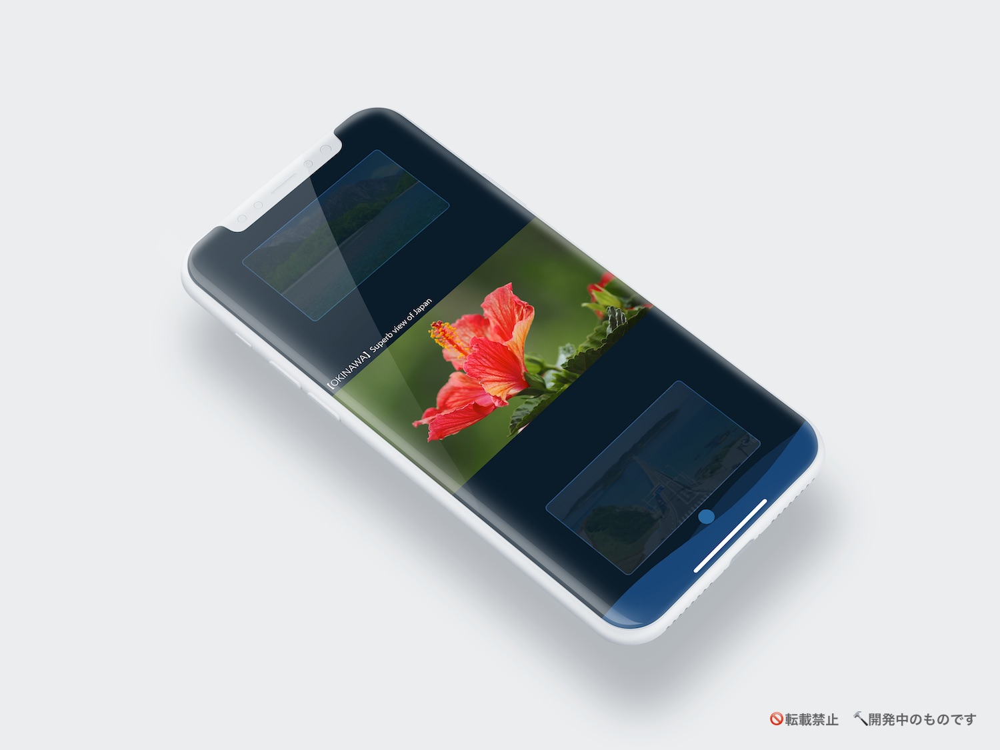
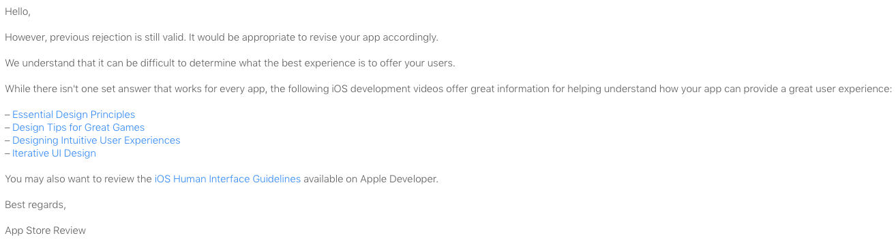
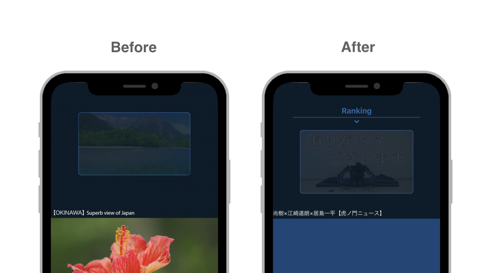

https://medium.com/shibuya-design-engineering

# Apple からの Reject 10連撃から学んだデザイン

Hello, 渋谷の某 IT 企業で iOS エンジニアをしている ITAYA です。

iPhone を始めとした iOS 搭載機器向けにアプリケーションを提供する App Store は、厳しい Apple のレビューによってある一定の品質が保たれています。そんな厳しいアプリレビューに人生最大の苦戦をして学んだことをご紹介します。

題材となるアプリは私が個人的に開発を行っている **動画視聴プラットフォーム** になります。まだ正式発表前のため、ここで提示するものはすべて開発途中のものになります。ご了承ください。

アプリ概要（一部）：
- 動画一覧をスクロール
- スクロールに合わせて再生される動画が自動で切り替わる
- 写真アプリから動画を読み込んで表示
- 動画のお気に入り登録
- 好きな動画の検索

機能に関しては既存の動画視聴アプリ同様、というより非常に少ないです。静止画と文字だけだと伝えられないのが辛いところですが、スクロースしたときのアニメーションや、動画の再生の仕組みにこだわっています。

# さっそく Reject された

「まぁ、そうだよね」と思いながら1回目の Reject は始まりました。そしてこの Reject 理由、知っている人であればゾッとするものです。なぜなら、 **ゴミアプリ** と言われたに等しいからです。また、何をすればこの Reject を突破できるのか、はっきりしないのも恐ろしいところです。
4.2 系はデフォルトで搭載されているような電卓を作ったときなどによく指摘されるガイドラインになります。「 **もう、そういうアプリ世の中にいっぱいあるからいらないよ** 」ということです。その中でも 4.2.2 は「 **それ Web でよくね？** 」という場合によく指摘されるガイドラインです。

静止画と文字だけしか知らない読者の皆さんであれば、「そのとおりだね（笑）」と思ったことでしょう。

次に対策を考えます。ここで私はお気に入り登録や検索機能に **レビュアーが気がついていないのでは？** と仮設を立てました。
静止画を見ていただければわかるように、通常時は動画とそのタイトルしか表示されておらず、各種機能を呼び出す **メニューは隠されて** います。表示するには一覧をスクロールしなければなりませんでした。しかも、5秒立つと表示されたメニューは再度非表示に戻っていました。
これに気がついてもらえるように、レビュアーへの伝言としてメモと操作中を録画した動画ファイルを添付しました。

（ちなみに、レビュアーが気が付かないということは **ユーザ体験も最悪** ということなので、これで審査通過するはずがありません）

# え？いまさらそこ指摘する？

アプリ申請経験者は誰もが一度は思ったことあるでしょう。2回目の Reject で指摘されたのは 1回めで指摘されていなかったスクリーンショットに関するものでした。
Apple 側もアプリ全部をまんべんなくレビューしていたら時間がいくらあっても足りないことは理解しています。だから **見られる箇所はバラバラ** なんです。大切なリリースを控えた申請で、今まで指摘されなかった箇所を偶然見られて Reject 、なんてこともよく起こるんですよ？（笑）

ここで指摘されてるのは、「各種デバイスの種類に合ったモックデザインを使いなさい」というものです。 **iPad のストアに表示されるスクリーンショットに iPhoneX が写っていてはいけない** ということです。数年前はこんなに厳しくなかったのですが…

# ヒントを貰った！

その後、改良と機能追加するも Reject は続き、レビュアーとメッセージでやり取りをしていました。そのなかで「 **これ見て勉強しなさい** 」とヒントを Apple が提示してきたのです。一般に公開されているものなので、同じリンクを載せておきます。

1. [Essential Design Principles](https://developer.apple.com/videos/play/wwdc2017/802/)
2. [Design Tips for Great Games](https://developer.apple.com/videos/play/design/811/)
3. [Designing Intuitive User Experiences](https://developer.apple.com/videos/play/design/14/)
4. [Iterative UI Design](https://developer.apple.com/videos/play/design/23/)

今回は、「Design Tips for Great Games」から学んで改良した点にフォーカスして紹介します。
Keynote の一部を上部に表示しております。 **現在の状態を適切に示すべき** であると説明がされていた箇所です。

検索した結果の動画やお気に入りに登録した動画など、「 **現在どの動画が表示されているかわからない** 」という問題に対して改良を施しました。
今までスクロールしないと表示されなかったメニューは、上部から **常に呼び出すことが可能** になりました。また、現在表示されている動画のジャンルに関しても **ひと目で分かる** ようになりました。

# Apple から国際電話！？

総 Reject 回数は10回を超えました。
ヒントを貰ってからの改良するも、何度も Reject を繰り返していました。そこで、Apple に電話で話がしたいと連絡すると日本時間を考慮して（？）朝8時前に **国際電話がかかってきました** （上記スクショは本物です 笑）。

電話で Apple の担当者から伝えられたのは以下の Reject 理由でした。
- **インタラクティブ性** がありません
- ネイティブアプリである必要がありません

ここで、一つ疑問が出てきました。動画のお気に入りや自由検索、写真アプリからの読み込みがそれに該当するのではないか　と。するとこのように答えてくれました。
- たとえそれがインタラクティブであったとしても、それが **アプリのコアコンセプトに準じた** 機能でなければならない

ネイティブアプリ独自であり、インタラクティブな機能として「写真アプリからの読み込み」を搭載していましたが、アプリのコアコンセプトから外れていることは確かでした。

# 10連撃＆国際電話で学んだこと

- **今アプリがどんな状態なのか** を適切にユーザに示すべき
- 4.2 系は機能不足である場合に指摘されるが、搭載されている機能の総数と直接的な関係はない
    - アプリの **コアコンセプトに準じた機能** が不足している
    - 何度 Reject が続いても **最高のユーザ体験を届ける** ことが目的であって、レビューを通すことが目的ではないということを見失ってはいけない
- スクリーンショットは、ストアで見たユーザがどんなアプリか把握できるものでなければならない
    - 枚数が多くても少なくても、 **どんなアプリか** 分からなかったらダメ
- 文化の違いなのか、レビューや電話で Apple は辛口コメントなので、 **メンタルは強く！**

最後まで読んでいただき、ありがとうございます。
つづく
