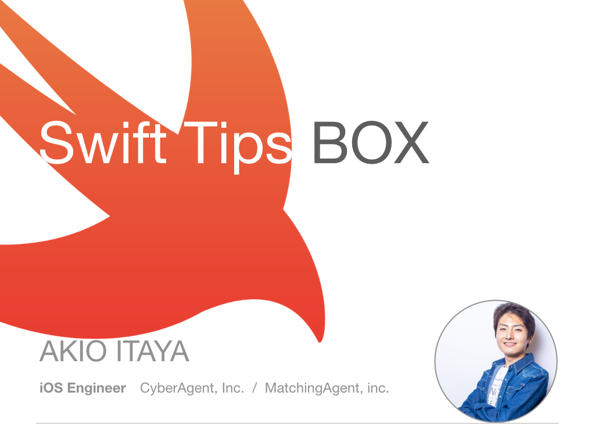

# Swift Tips BOX
この記事は[CyberAgent Developers Advent Calendar 2018](https://adventar.org/calendars/2951) 5日目の記事です。
マッチングエージェントで恋活アプリ[タップル誕生](https://tapple.me)の iOS 版を開発している板谷（[@AkkeyLab](https://github.com/AkkeyLab)）です。今年の春に新卒で入社しました。

今回は日々の学びを Swift Tips として紹介したいと思います。
なお、内容に関しては弊社で取り入れているものだけでなく、個人アプリ開発で利用しているものも含みます。よって、個人的な意見を含みますので、ご理解いただいた上で読んでいただければ幸いです。

- [自動化](#自動化)
- [可読性](#可読性)
- [アクセス修飾子](#アクセス修飾子)
- [定数と変数](#定数と変数)
- [非同期処理](#非同期処理)
- [クロージャ](#クロージャ)
- [分岐処理](#分岐処理)
- [メソッド](#メソッド)
- [protocol](#protocol)
- [enum](#enum)
- [StackView](#stackview)
- [Storyboard](#storyboard)
- [Animation](#animation)
- [UIPickerView](#uipickerview)
- [UIDatePicker](#uidatepicker)
- [UITableView](#uitableview)
- [UILabel](#uilabel)
- [Delegate](#delegate)
- [Extension](#extension)
- [RxSwift](#rxswift)
- [Library](#library)
- [その他便利](#その他便利)

## 自動化
macOS の環境構築はある程度自動化している。

| 種類         |              ツール |
|:------------:|:------------------:|
| CUI Apps     |🍺 [Homebrew](https://github.com/Homebrew/brew/) |
| GUI Apps     |[Homebrew-Cask](https://github.com/caskroom/homebrew-cask) |
| App Store    |[mas](https://github.com/mas-cli/mas) |

[GitHub : AkkeyLab/mac-auto-setup](https://github.com/AkkeyLab/mac-auto-setup)

## 可読性
`isEmpty` を使用して、なおかつ `!` で真偽値を反転すると、最終的に **文字列が格納されているか** を判定したいという意味がわかりにくくなる。そこで、以下の改善後のように明示的に **どうであってほしいか** を判定式に盛り込むことで可読性を上げることができる。また、複数の判定が関係する場合は同じ形式に揃えることも検討すべきである。
```swift
// 改善前
if !(data.apple.isEmpty) && !(data.swift.isEmpty) && data.user == .akkey {
    print("done")
}
// 改善後
if data.apple.isEmpty == false && data.swift.isEmpty == false && data.isAkkey == true {
    print("done")
}
```

## アクセス修飾子
アクセス修飾子 | 挙動
----- | -----
`open` | モジュール外からもアクセスできる
`public` | モジュール外からもアクセスできる、サブクラス化されない、 override できない
`internal` | モジュール内に限りアクセスできる
`fileprivate` | ファイル内に限りアクセスできる
`private` | 宣言した中に限りアクセスできる、 extension 内からもアクセス可能

\* モジュール : import を使って取り組むプログラム群  
参考：[\[Swift 3.0\] アクセス修飾子にopenとfileprivateが追加された話](https://dev.classmethod.jp/smartphone/iphone/swift3_scoped_access_level/)

---

set のみ private にして、 get は public にしたい場合がある。これを実現する方法は複数あるが、 Swift であれば比較的簡単に実現できるので、比較して以下に示す。 `private(set)` とすることで setter のみを private にすることができる。逆に、 get を private にして set を public にすることは一般的にすべきでない。
```swift
// 一般的な方法
private var _data: String = ""
public var data: String {
    return _data
}
_data = "AKKEY"

// 修正後
public private(set) var data: String = ""
data = "AKKEY"
```

## 定数と変数
変数定義の方法を複数紹介する。
```swift
// ポインタアドレスの固定なので可能
// ただし、 Array や Dictionary はアドレス変更が必要なので不可
let data = User()
data.value = 8

// setter と getter
var value: Int {
    get { return 0 }
    set { _ = newValue }
}

// getter
let value: Int {
    return 0
}

// didSet
var value: Int = 0 {
    didSet {
        self.update()
    }
}
var value: Int! {
    didSet {
        value = 100
    }
}

// 使うときに初期化される
lazy var data: User = {
    return User()
}()
```

---

`type(of:)` を利用することで型名を取得することができる。
```swift
let moji = "moji"
print(type(of: moji)) // "String\n"

class akkey {
    func main() {
        print("My name is \(type(of: self))")
    }
}

let classObj = akkey()
classObj.main() // "My name is akkey\n"
```

---

定数を複数定義するときはenumを利用することできれいに定義することができる。
```swift
private final let margin = CGFloat(8)

private enum Const {
    static let margin = CGFloat(8)
}
```

---

setter や getter を利用したい場合には以下のように実装するとよい。
```swift
class TextFieldView {
    var placeholder: String {
        set {
            textField.placeholder = newValue
        }
        get {
            return textField.placeholder ?? ""
        }
    }
}
let view = TextFieldView()
view.placeholder = "Placeholder"
```

また、 getter だけを利用する場合は willSet を利用する。
```swift
var type: SampleType = .normal {
    willSet(value) {
        // 変更後の値
    }
    didSet(value) {
        // 変更前の値

        // 現在の値を利用
        backgroundColor = type.color
    }
}
```

## 非同期処理
Swift の GCD (Grand Central Dispatch) を用いてマルチスレッド処理の実行を行う。
非同期処理は `async` 系を利用する。明示的に同期処理を実現する場合は `sync` 系を利用する。

---

`Timer` 以外にも実行時間を遅延させる方法がある。以下の例は5秒後にブロック内の処理をするものである。
```swift
DispatchQueue.main.asyncAfter(deadline: .now() + 5) {
    // 処理
}
```
参考：[[Swift 3] Swift 3時代のGCDの基本的な使い方](https://dev.classmethod.jp/smartphone/iphone/swift-3-how-to-use-gcd-api-1/)

---

非同期処理の一つとして、 Json ファイルを文字列URLで取得して Data 型に変換する例を以下に示す。
```swift
guard let url = URL(string: "https://akkeylab.com/animation.json") else { return }
url.asyncDownload { data, response, error in
    guard
        let data = data,
        let dict = (try? JSONSerialization.jsonObject(with: data)) as? [String: Any] else {
            return
    }
    DispatchQueue.main.async {
        // 使用例（Lottie）
        self.animationView.setAnimation(json: dict)
    }
}

private extension URL {
    func asyncDownload(completion: @escaping (_ data: Data?, _ response: URLResponse?, _ error: Error?) -> ()) {
        URLSession.shared.dataTask(with: self) {
            completion($0, $1, $2)
            }.resume()
    }
}
```

## クロージャ
非同期処理が完了もしくは失敗した段階で値を返したい場合がある。このような場合はクロージャを用いて実現する。
```swift
class Model {
    func getUserData(success: ((Bool) -> Void)?, failure: ((Bool) -> Void)?) {
        success?(true)
        failure?(false)
    }
}

// 呼び出し側
let model = Model()
model.getUserData(success: { res in
    print(res ? "TRUE" : "FALSE")
}, failure: { res in
    print(res ? "TRUE" : "FALSE")
})
```

---

クロージャ内で `self` を用いる場合は `[weak self]` を利用しなければならない状況がある。以下のように実装を行う。ただし、 `self` を新しい変数として利用することもできる。
```swift
mmm.subscribe({ [weak self] in
    guard let `self` = self else { return }
    self.label.text = ""
})
```

---

Kotlin に存在するスコープ関数の一つである apply を Swift で再現した処理記述することが可能である。
例えば、自分自身のオブジェクトを作成して戻す create 関数などを呼ぶと同時に初期値を設定したい場合に有効活用できる。クロージャの中でインスタンス化したオブジェクト this に対する処理を行うことができる。
```swift
protocol ApplyProtocol {}
extension ApplyProtocol {
    @discardableResult
    func apply(closure: (_ this: Self) -> Void) -> Self {
        closure(self)
        return self
    }
}
extension NSObject: ApplyProtocol {}

class Sample: NSObject {
    static func create(type: SampleType) -> Self {
        return UINibView.instantiate(self).apply { this in
            this.setup(type: type)
        }
    }
}
```

## 分岐処理
`nil` が返ってきたときに返す値を指定することができる。`(model.data.hoge ?? "").isEmpty` といった使い方をすることができる。
```swift
var str: String?
str = nil
print(str ?? "NG") // NG
```

## メソッド
引数の値に初期値を設定することができる。初期値を設定している引数に関しては、値を渡さずにメソッドを呼ぶことができる。
```swift
func createData(name: String, number: Int = 0, plus: String = "nil") -> String {
    return "\(name) | \(number) | \(plus)"
}

createData(name: "AKIO") // "AKIO | 0 | nil"
createData(name: "AKIO", number: 8) // "AKIO | 8 | nil"
createData(name: "AKIO", number: 8, plus: "OK") // "AKIO | 8 | OK"
```

## protocol
protocol は extension で拡張することができる。この機能を利用することで、ある Class に対して外部からメソッドを追加するという仕組みを実現することができる。
```swift
protocol GoldProtocol {
    func createGold()
}

extension GoldProtocol {
    func createGold() { print("GOLD") }
    func newFunction() { print("NEW") }
//  func noneProcess() // Error
}

class GoldClass: GoldProtocol { }

GoldClass().createGold() // "GOLD\n"
GoldClass().newFunction() // "NEW\n"
```

また、どの Class に対して機能拡張を行うかを指定することも可能である。
```swift
protocol VCProtocol {
    func createVC()
}

extension VCProtocol where Self: UIViewController {
    func createVC() { print("CREATE") }
}

class VCClass: UIViewController, VCProtocol { }
// class VVClass: VCProtocol { } // Error

VCClass().createVC() // "CREATE\n"
```

## enum
enum は定義場所によって呼び出し方が変わってくる。
```swift
enum globalEnum: String {
    case name = "NAME"
}

class EnumTest {
    enum localEnum: String {
        case name = "NAME"
    }
}

class EnumUsingTest {
    func main() {
        print(globalEnum.name.rawValue) // "NAME\n"
//        print(localEnum.name) // Error
        print(EnumTest.localEnum.name.rawValue) // "NAME\n"
    }
}

EnumUsingTest().main()
```

---

Swift 4.2 から enum の全件数を取得することができる。
```swift
enum Fruits: CaseIterable {
    case apple, orange, banana
}

Fruits.allCases.count
```

## StackView
コード側から StackView に追加した button を削除するには二段階の remove が必要になる。まず、 StackView から削除対象の button を `removeArrangedSubview` で削除する。次に、削除対象の button に対して `removeFromSuperview` を呼ぶ必要がある。また、 StackView から対象の button を探す場合は `flatMap` を使用する方法がある。
```swift
// buttonStackView に UIButton 型の button が配置されている
buttonStackView.arrangedSubviews.flatMap { $0 as? UIButton }.forEach {buttonView in
    self.buttonStackView.removeArrangedSubview(buttonView)
    buttonView.removeFromSuperview()
}
```

## Storyboard
Storyboard と対になる Class の名前が互いに同じ場合、以下の方法でインスタンス化することができる。
```swift
class Storyboard {
    static func instantiate<T: UIViewController>(_ type: T.Type) -> T {
        let storyboard = UIStoryboard(name: String(describing: type), bundle: Bundle.main)
        return storyboard.instantiateInitialViewController() as! T
    }
}

let vc = Storyboard.instantiate(NextPageViewController.self)
self.navigationController?.pushViewController(vc, animated: true)
```

なお、 Xib ファイルの場合も同様に以下のように書くことができる。
```swift
class UIXibView {
    static func instantiate<T: UIView>(_ type: T.Type) -> T {
        let nib = UINib(nibName: String(describing: String(describing: type)), bundle: nil)
        return nib.instantiate(withOwner: nil, options: nil)[0] as! T
    }
}

let xib = UIXibView.instantiate(self)
addSubview(xib)
```

---

Xib で作成した View を既存の View に addSubview する場合に、既存の View サイズぴったりに貼り付けるには以下のようにサイズ指定を行う。なお、 StackView を利用するとオプションで指定するだけで実現することも可能である。
```swift
xibView.frame = view.bounds
view.addSubview(xibView)
```

---

class のインスタンス化に失敗する場合、 class file と Storyboard file の紐づけが正常にできていない可能性がある。その場合は以下のように `customModule="AkkeyTV" customModuleProvider="target"` が正常に追加されているかの確認を行う。
```xml
<!--TV View Controller-->
<scene sceneID="cNt-09-DWp">
    <objects>
        <viewController id="5Wt-BC-mVB" customClass="TVViewController" customModule="AkkeyTV" customModuleProvider="target" sceneMemberID="viewController">
```

## Animation
AutoLayout を用いて制約をつけているパーツをアニメーションさせる場合、 `self.view.layoutIfNeeded()` を呼ぶ必要がある。
```swift
@IBOutlet private weak var viewTop: NSLayoutConstraint?
self.view.layoutIfNeeded()
viewTop.constant = 10
UIView.animate(withDuration: 0.5, animations: {
    self.view.layoutIfNeeded()
}, completion: nil)
```

## UIPickerView
UITextField に UIPickerView での変更をリアルタイムで反映させる表示方法を簡単に実現することができる。**UITextField** の inputView に UIPickerView を設定することで実現可能である。
```swift
private var textField: UITextField?
private var picker: UIPickerView?

override func viewDidLoad() {
    picker = UIPickerView()
    picker?.dataSource = self
    picker?.delegate = self

    textField = UITextField()
    // UITextField の inputView に UIPickerView を設定
    // inputAccessoryView で KeyboardAccessary も設定可能
    textField?.inputView = picker

    // 初期位置の設定
    picker.selectRow(data[1], inComponent: 0, animated: true)
}

func numberOfComponents(in pickerView: UIPickerView) -> Int {
    return 1
}

func pickerView(_ pickerView: UIPickerView, numberOfRowsInComponent component: Int) -> Int {
    return data.count
}

func pickerView(_ pickerView: UIPickerView, titleForRow row: Int, forComponent component: Int) -> String? {
    return data[row].text
}

func pickerView(_ pickerView: UIPickerView, didSelectRow row: Int, inComponent component: Int) {
    guard let picker = self.picker else { return }
    // リアルタイム更新
    textField.text = self.pickerView(picker, titleForRow: row, forComponent: 0)
}
```

---

UIPickerView をコード側から手動で表示させることができる。方法としては UITextField をタップして編集モードに入れることで可能となる。よって、以下のように UITextField から becomeFirstResponder を呼ぶ。
```swift
let textField = UITextField()
textField.becomeFirstResponder()
```

## UIDatePicker
UITextField に UIDatePicker での変更をリアルタイムで反映させる表示方法を簡単に実現することができる。**UITextField** の inputView に UIDatePicker を設定することで実現可能である。
``` swift
private var textField: UITextField?
private var picker: UIDatePicker?

override func viewDidLoad() {
    picker = UIDatePicker()
    // 各種設定
    picker?.datePickerMode = .date
    picker?.calendar = Calendar(identifier: .gregorian)
    // picker の値が変動したときに呼ばれる関数の設定
    picker?.addTarget(self, action: #selector(change), for: .valueChanged)
    // UITextField の inputView に UIDatePicker を設定
    // inputAccessoryView で KeyboardAccessary も設定可能
    textField?.inputView = picker

    // 初期位置の設定
    picker.setDate(day, animated: true)
}

@objc private func change() {
  textField.text = picker.date
}
```

## UITableView
UITableView の footer は UIView を利用する。以下のように実装することができる。
```swift
let tableView = UITableView()
tableView.delegate = self

extension AKTableViewController: UITableViewDelegate {
    var footerHeight: CGFloat {
        return 44
    }

    func tableView(_ tableView: UITableView, viewForFooterInSection section: Int) -> UIView? {
        let footerView = UIView(frame: CGRect(x: 0, y: 0, width: tableView.frame.size.width, height: footerHeight))
        footerView.backgroundColor = UIColor.blue
        return footerView
    }

    func tableView(_ tableView: UITableView, heightForFooterInSection section: Int) -> CGFloat {
        return footerHeight
    }
}
```

---

UITableView の header の高さに AutoLayout を反映させたい場合は以下のような処理を実行する。 header の高さが変動するような処理を行ったらこの処理を実行して高さの変化を反映させる。
```swift
private func sizeHeaderToFit() {
    guard let headerView = tableView.tableHeaderView else { return }

    headerView.setNeedsLayout()
    headerView.layoutIfNeeded()

    let height = headerView.systemLayoutSizeFitting(UIView.layoutFittingCompressedSize).height
    var frame = headerView.frame
    frame.size.height = height
    headerView.frame = frame

    tableView.tableHeaderView = headerView
}
```

## UILabel
UILabel 内に文字が入りきれなくなった場合にできるだけ全文を表示させたい時がある。その場合は文字サイズを小さくすることで対応が可能である。以下のように最大でどれくらいスケールダウンしてもよいかを指定する。
```swift
let label = UILabel()
label.adjustsFontSizeToFitWidth = true
label.minimumScaleFactor = 0.8 // 最大で 80% スケールダウン
```

## Delegate
Swift によるコードサンプルを以下に示す。
なお、 protocol 宣言時に class を継承させているため、 class に対してのみ使用できるようになっている例である。
```swift
protocol GoldProtocol: class {
    func createGold()
}

class GoldClass: GoldProtocol {
    func createGold() { print("GOLD") }
}

class MainClass {
    weak var delegate: GoldProtocol!

    func useDelegate() {
        delegate.createGold()
    }
}

let main = MainClass()
let gold = GoldClass()
main.delegate = gold
main.useDelegate() // "GOLD\n"
```

protocol の extension を利用すると以下のように実装することも可能である。
```swift
protocol GoldProtocol: class {
    func createGold()
}

extension GoldProtocol {
    func createGold() { print("GOLD") }
    func newFunction() { print("NEW") }
}

class GoldClass: GoldProtocol { }

class MainClass {
    weak var delegate: GoldProtocol!

    func useDelegate() {
        delegate.createGold()
    }
}

let main = MainClass()
let gold = GoldClass()
main.delegate = gold
main.useDelegate() // "GOLD\n"
```

## Extension
extension を利用することで `UILabel().akkeyFunc` のように機能を追加することができるが、コードを読む上でこの機能がもとから存在していたものなのか、 extension で追加されたものなのかがはっきりしないという問題点がある。また、今後 Swift の update などで独自に追加した機能と同じものが標準搭載されることになった場合、コンフリクトを起こしてしまう。これらの問題解決策として **extension のメソッドにプレフィックスを付ける** ことを考えてみる。
```swift
public struct AkkeyTV<Base> {
    public let base: Base
    public init(_ base: Base) {
        self.base = base
    }
}

// ここの akkeytv プロパティは Rx の hoge.rx.hoge と同じように使える
// この protocol を使うと akkeytv プロパティが使用可能となる
// ただし、ここでは akkeytv の実装がされていない
public protocol AkkeyTVCompatible {
    associatedtype CompatibleType
    static var akkeytv: AkkeyTV<CompatibleType>.Type { get set }
    var akkeytv: AkkeyTV<CompatibleType> { get set }
}

// akkeytv プロパティの実装
extension AkkeyTVCompatible {
    public static var akkeytv: AkkeyTV<Self>.Type {
        get {
            return AkkeyTV<Self>.self
        }
        set { }
    }
    public var akkeytv: AkkeyTV<Self> {
        get {
            return AkkeyTV(self)
        }
        set { }
    }
}

// NSObject で akkeytv プロパティが利用可能となった
extension NSObject: AkkeyTVCompatible { }

extension AkkeyTV where Base: UILabel {
    func akkeyTextSet() {
        base.text = "I love AkkeyTV app."
    }
}

class useAkkeyTV: NSObject {
    func main() {
        let label = UILabel()
        label.akkeytv.akkeyTextSet()
    }
}
```

extension で値を持った変数を追加することはできません。ただし、以下のように変数を定義することは可能です。
```swift
extension UIView {
    var computedProperty: String {
        return "Akkey"
    }
}
```

## RxSwift
subscribe の処理を記述するときに、 渡ってくる Optional な値を扱うために `guard let` を利用することがあるが、 `map` と `filterNil` を利用することで、綺麗に記述することができる。以下にその一例を示す。

```swift
private func addRxObserver() {
    store.error
        .subscribe(onNext: { [weak self] error in
            guard let error = error as? CustomError else { return }
            switch error {
            ...
```
```swift
// Refactoring
private func addRxObserver() {
    store.error
        .map { $0 as? CustomError }
        .filterNil()
        .subscribe(onNext: { [weak self] error in
            switch error {
            ...
```
```swift
// RxSwift+FilterNil.swift
// https://gist.github.com/gravicle/8fd14b940e97e6d4bc7ecfec3703fd2e
import Foundation
import RxSwift

protocol OptionalType {
    associatedtype Wrapped
    var value: Wrapped? { get }
}

extension Optional: OptionalType {
    var value: Wrapped? {
        return self
    }
}

extension Observable where Element: OptionalType {

    func filterNil() -> Observable<Element.Wrapped> {
        return flatMap { (element) -> Observable<Element.Wrapped> in
            if let value = element.value {
                return .just(value)
            } else {
                return .empty()
            }
        }
    }
}
```

## Library
- Nuke

Nuke を利用して描画した UIImageView が UICollectionViewCell などの再利用箇所に使用される場合、再利用時の初期化処理に気をつけなければならない。 NukeImageView の image を nil にするだけではキャッシュ機能が終了しないため、以下のようにタスク終了を行う必要がある。
```swift
let imageView = NukeImageView()
Nuke.cancelRequest(for: imageView)
imageView.image = nil
```

## その他便利
`String` 型の文字列先頭を簡単に大文字にすることができる。
```swift
let mmoji: String = "moji"
mmoji.capitalized // "Moji"
```

---

文字列比較は以下のようにできる。
```swift
let twString = "Twitter 連携による施策です。これからもよろしくお願いします。"
if twString.contains("Twitter 連携による施策です。") {
    print("文字列一致") // 実行される
}

if twString.contains("twitter 連携による施策です。") {
    print("文字列一致") // 実行されない
}

if twString.lowercased().contains("twitter 連携による施策です。") {
    print("文字列一致") // 実行される
}
```

---

NavigationBar とその下のコンテンツとの間に表示される境界線を非表示にすることができる。方法としては、 NavigationBar の shadowImage を初期化して、空にしてしまうというものである。また、同様の方法でブラー表示部分も削除することができる。
```swift
let nc = navigationController?.navigationBar
nc?.setBackgroundImage(.init(), for: .default) // ブラー削除
nc?.shadowImage = .init() // 境界線削除
```
---

以下のようにして addSubview した view を前面・背面に移動させることができる。
```swift
let view = UIView()
addSubview(view)
bringSubview(toFront: view) // 前面に移動
sendSubview(toBack: view) // 背面に移動
```
